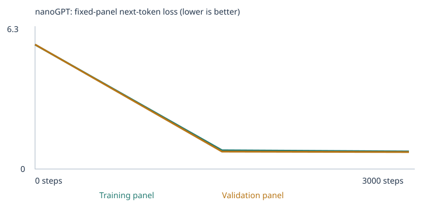
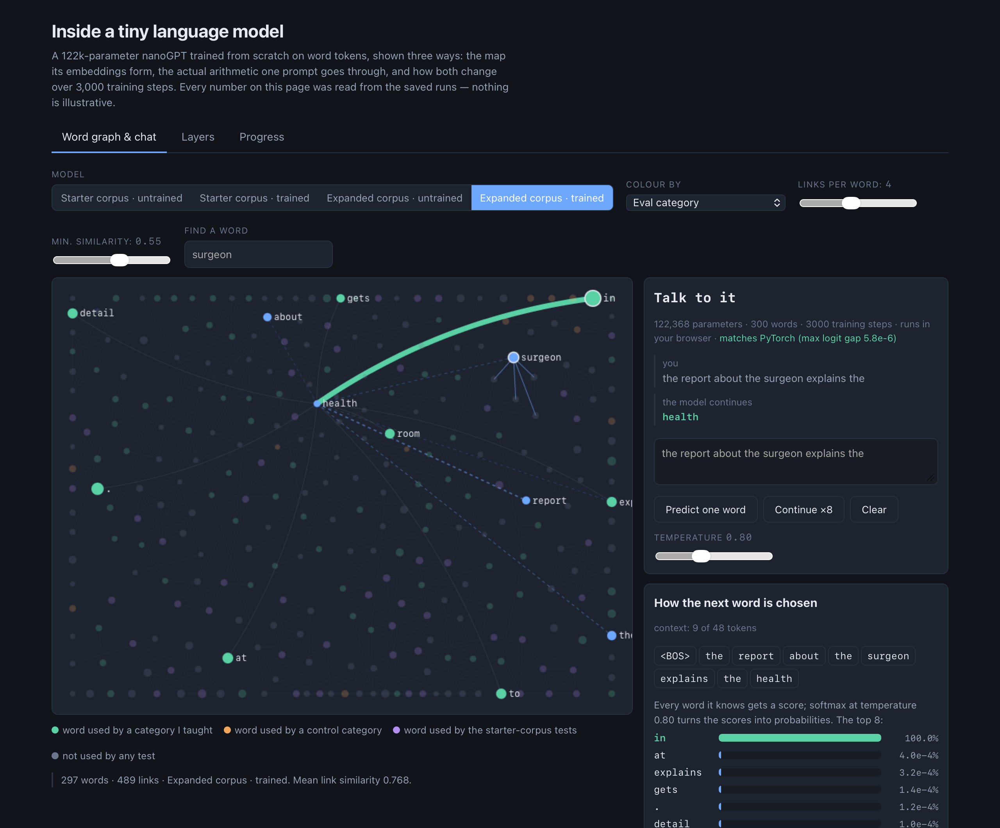
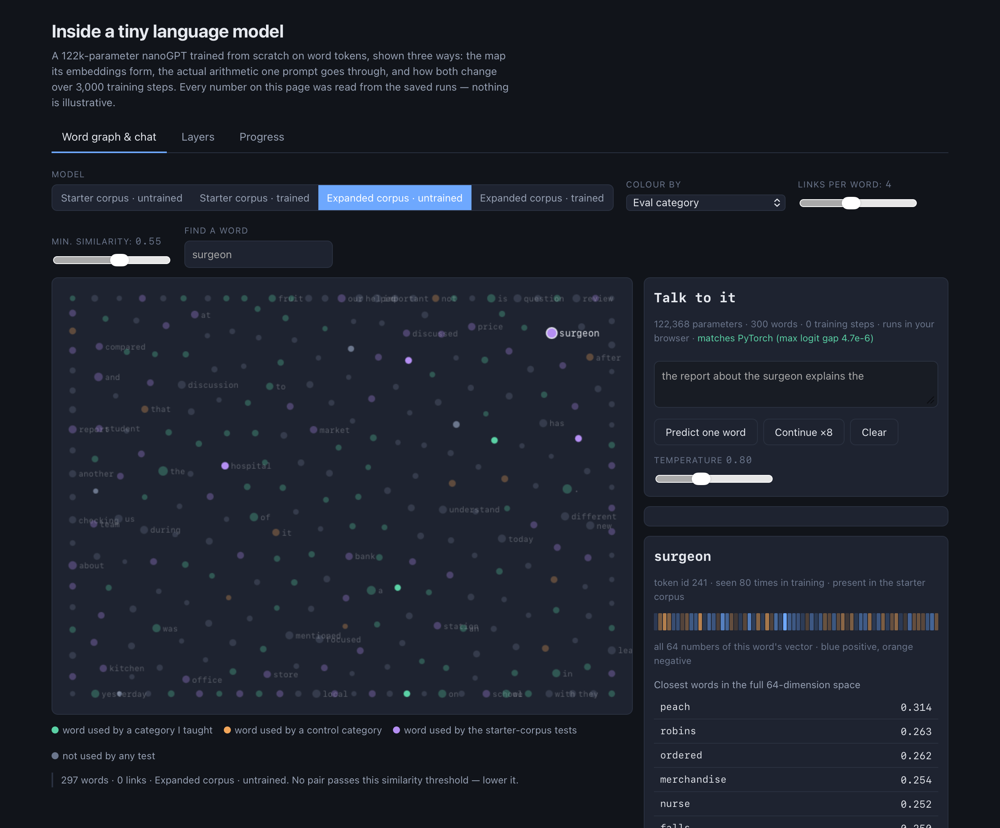
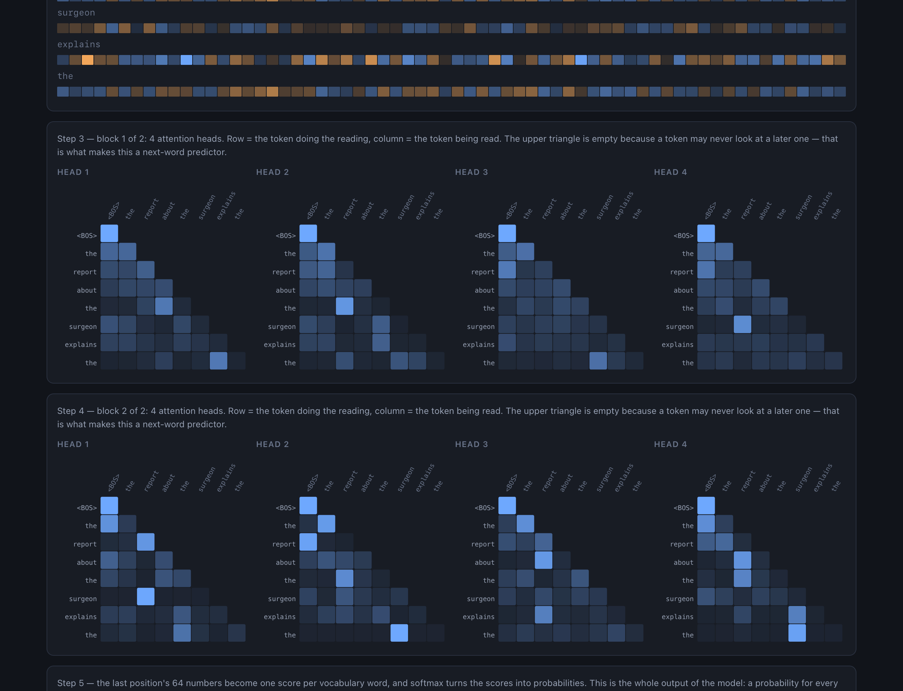
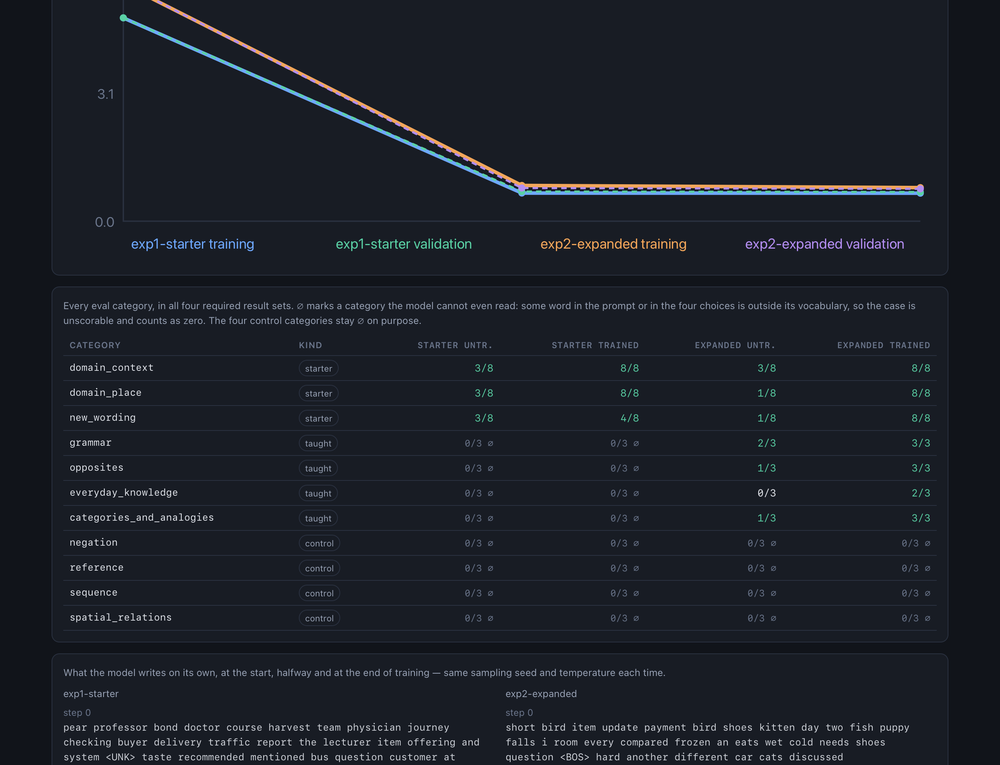
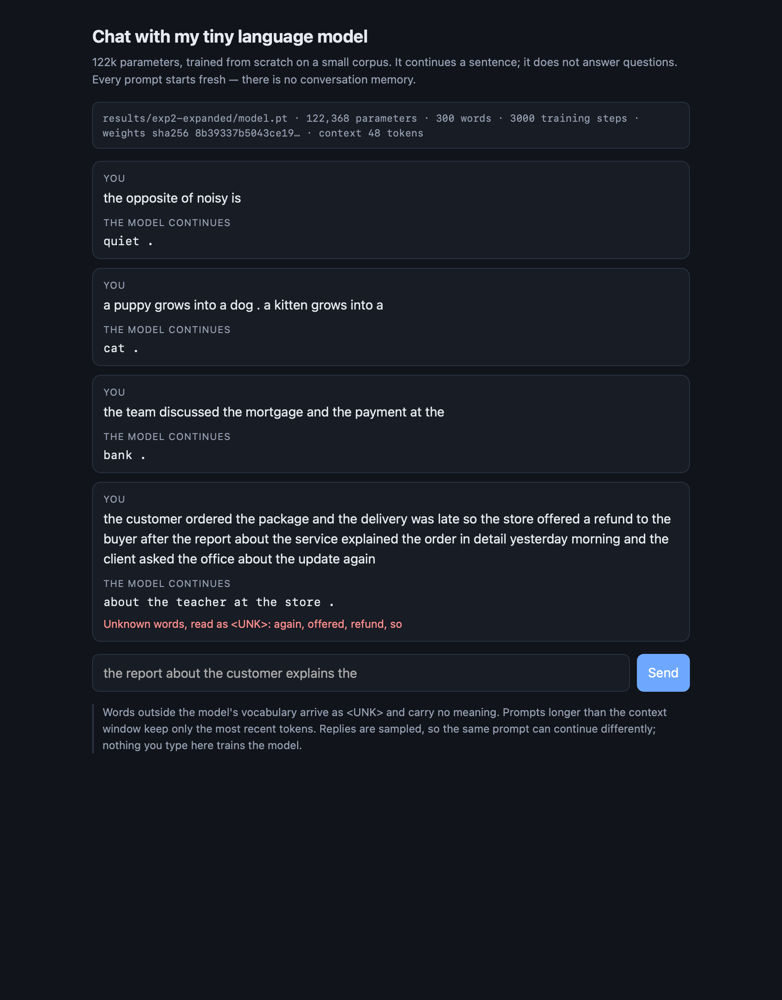

# A tiny language model, built and taken apart

A 2-block, 4-head, 64-number nanoGPT — **122,368 parameters** — trained from
scratch on word tokens, then measured with a fixed 48-case exam it never saw in training, and
finally opened up so you can watch it choose a word.

**▶ [Open the interactive explorer](https://geromola.github.io/custom-llm/viz/)** — the map of what the model thinks is related, a
chat box that runs the real weights in your browser, and the arithmetic behind every prediction.

| | Starter corpus | Expanded corpus |
|---|---|---|
| 48-case exam, before training | 9/48 | 9/48 |
| 48-case exam, after training | **20/48** | **35/48** |
| Cases it could even read | 24/48 | 36/48 |
| Of the 12 cases I taught for | 0/12 | **11/12** |
| Of the 12 cases I deliberately did **not** teach | 0/12 | 0/12 |

The headline is not the score. It is that the gain is **confined to exactly what I taught**: the
12 control cases score zero in every run, before and after, in both experiments and at three
different random seeds.

---

## Contents

- [What is in this repository](#what-is-in-this-repository)
- [The three choices](#the-three-choices)
- [The corpus I wrote](#the-corpus-i-wrote)
- [What I predicted, and what actually happened](#what-i-predicted-and-what-actually-happened)
- [The exam: all four result sets](#the-exam-all-four-result-sets)
- [Is the improvement real?](#is-the-improvement-real)
- [One case that fails, and why it is my fault](#one-case-that-fails-and-why-it-is-my-fault)
- [How this thing actually learns](#how-this-thing-actually-learns)
- [Training curves and samples](#training-curves-and-samples)
- [The interactive explorer](#the-interactive-explorer)
- [Chat with the model](#chat-with-the-model)
- [Reproducing everything](#reproducing-everything)
- [Limitations and the next experiment](#limitations-and-the-next-experiment)

---

## What is in this repository

| Path | What it is |
|---|---|
| [`custom_llm.ipynb`](custom_llm.ipynb) | Executed notebook, **expanded-corpus** experiment, outputs intact |
| [`custom_llm_starter.ipynb`](custom_llm_starter.ipynb) | Executed notebook, **starter-corpus** experiment |
| [`PREDICTION.md`](PREDICTION.md) | What I expected, committed to git *before* the first training run |
| [`make_corpus.py`](make_corpus.py) | Generates my teaching corpus and withholds anything that collides with the exam |
| [`corpus/`](corpus) | The teaching material itself: 3 Markdown files and 1 PDF, all written by me |
| [`evals/language_evals.json`](evals/language_evals.json) | The supplied 48-case exam, unchanged |
| [`run_evals.py`](run_evals.py) | The supplied scorer: inference only, never trains |
| [`results/`](results) | Every run: weights, corpus, eval results, losses, samples |
| [`viz/`](viz) | The interactive explorer, its data exporters and the in-browser model |
| [`chat.py`](chat.py) · [`chat_web.py`](chat_web.py) | Terminal and web chat interfaces |
| [`build_readme.py`](build_readme.py) | Generates this file from the saved results |

Starter notebook, `run_evals.py`, `chat.py`, `nanogpt_model.py`, the eval suite and
`embedding-viewer.html` come from the course sample project
[`pepealonso95/custom-llm`](https://github.com/pepealonso95/custom-llm); the network itself is
[Karpathy's nanoGPT](https://github.com/karpathy/nanoGPT) at the pinned commit
`3adf61e154c3`, hash-checked on every run ([`NANOGPT_LICENSE`](NANOGPT_LICENSE)).

---

## The three choices

| Choice | Value | Why |
|---|---|---|
| **Corpus** | Run 1: classroom sentences only. Run 2: the same plus 1,418 passages I wrote | The corpus is the *only* difference between the two runs, so any change in the exam has one candidate cause |
| **Training steps** | 3,000 in both | The suggested budget, and validation loss is already flat there. Holding it identical matters more than tuning it: train run 2 longer and I could not tell new data from extra steps |
| **Learning rate** | 0.001 in both | The notebook default, with 100-step warmup and cosine decay to 10%. Much larger and AdamW's steps overshoot — the loss oscillates or goes non-finite, which the notebook guards against. Much smaller and 3,000 steps end near the random start, with loss barely below ln(vocabulary) |

Everything else — seed 42, 2 blocks, 4 heads, 64
numbers per token, 48-token context, batch 32 — is the supplied
default and identical across both runs.

---

## The corpus I wrote

The starter corpus is synthetic classroom sentences. Its vocabulary has no word for *opposite*,
*ice*, *robin* or *walked*, so **all 24 extension cases are unreadable** to it: some word in the
prompt or in the four answers is outside the vocabulary, the case is marked
`out_of_vocabulary`, and it scores zero no matter how long you train.

So I wrote teaching material for **four** of the eight extension categories, and deliberately
wrote **nothing** for the other four:

| Taught | Left as a control |
|---|---|
| `grammar`, `opposites`, `everyday_knowledge`, `categories_and_analogies` | `negation`, `reference`, `sequence`, `spatial_relations` |

That makes the other 12 cases an internal control group: same model, same exam, same training
run. If their scores moved, something other than my teaching material would be responsible.

### What it contains

| File | Passages | Form |
|---|---:|---|
| `corpus/grammar.md` | 420 | Markdown |
| `corpus/opposites.md` | 420 | Markdown |
| `corpus/everyday_knowledge.pdf` | 252 | **PDF**, rendered from [`corpus_sources/everyday_knowledge.md`](corpus_sources/everyday_knowledge.md) |
| `corpus/categories_and_analogies.md` | 329 | Markdown |
| **Total** | **1,421** (1,418 unique) | adds 200 distinct token types |

Permissions are simple: I wrote all of it, generated by [`make_corpus.py`](make_corpus.py) from
templates I chose. No outside documents, no personal data, nothing confidential.

### Keeping the exam out of the textbook

`make_corpus.py` generates freely and then **withholds** any line that reproduces a test prompt,
using the starter's own matching rule — the same idea the notebook applies to its own generated
sentences. It reserved **61 lines**, including every
`the opposite of hot is cold`, every `one bird is …` and every `yesterday she …`.

Two subtleties I had to handle, both visible in the code:

1. **The notebook checks an imported file as one continuous stream**, not line by line. So
   `a carrot is a vegetable .` on one line followed by `an apple is a fruit .` on the next
   reproduces a test prompt across the line break even though neither line does alone.
   `order_lines()` orders every file so no window of three consecutive lines contains a prompt,
   and the file-level check runs again before anything is written.
2. **`chunk_text` splits on a sentence mark followed by whitespace**, so every training passage
   is a single sentence and a file corpus cannot teach a two-clause pattern at all — which is
   what the analogy cases are. Writing the period glued to the next word
   (`a duck is a bird .a goat is an animal .`) keeps both clauses in one passage; the tokenizer
   matches words and single punctuation marks and ignores whitespace, so the training tokens are
   *identical* to the spaced version. 263
   of my analogy passages use this, and the leakage check still runs on the joined passage
   exactly as the model sees it.

### The separation audit

Leakage is the one thing in this assignment that can cost marks beyond its own category, so
[`verify_separation.py`](verify_separation.py) checks it from six directions and writes
[`separation_audit.json`](separation_audit.json). Run it yourself with
`python verify_separation.py`.

| # | Check | Result |
|---|---|---|
| 1 | Eval prompts found in any training input (12 audited, across all 7 runs) | **0** |
| 2 | `prompt + answer` strings found in training text | **0** |
| 3 | Training lines holding 3+ choices from one case (a copied answer list) | **0** |
| 4 | Eval files, eval results or chat transcripts inside a corpus folder | **0** |
| 5 | Vocabulary built only from training passages | **yes** |
| 6 | Trained and untrained weights differ; one single suite hash across every run | **yes** |

The suite hash `1d7c503f34d88260d0ac897b…` is identical in all 7 runs and in both stages of each, so
the same 48 cases, the same four choices and the same answer key scored everything. The scorer
[`run_evals.py`](run_evals.py) only ever runs inference, and asserts the model's hash is
unchanged afterwards — if scoring had nudged a single weight it would have raised.

### What *does* overlap, and why that is allowed

The assignment is explicit that ordinary words and underlying subject knowledge may overlap;
only the test items themselves must stay out. So the honest question is not "is there any
overlap" but "how close does the training text get". For 20 of the 48 cases, the last
three words of the prompt are followed by the correct answer somewhere in training:

| Case | Category | Phrase in training text | Times |
|---|---|---|---:|
| `lang_46` | categories_and_analogies | `…salmon is a fish` | 31 |
| `lang_48` | categories_and_analogies | `…apple is a fruit` | 27 |
| `lang_09` | domain_place | `…service at the store` | 20 |
| `lang_10` | domain_place | `…quality at the market` | 20 |
| `lang_11` | domain_place | `…payment at the bank` | 20 |
| `lang_12` | domain_place | `…juice at the kitchen` | 20 |
| `lang_13` | domain_place | `…journey at the station` | 20 |
| `lang_14` | domain_place | `…security at the office` | 20 |
| `lang_15` | domain_place | `…patient at the hospital` | 20 |
| `lang_16` | domain_place | `…lesson at the school` | 20 |
| `lang_47` | categories_and_analogies | `…grows into a cat` | 11 |
| `lang_45` | everyday_knowledge | `…turn on a light` | 7 |

Two worked examples of what is behind those counts:

- **`lang_09`** — the test prefix is `the team discussed the customer and the service at the`
  → **store**. That exact sentence **is not in the training text**; the notebook reserved it,
  along with 159 other passages, before the split and before the vocabulary was built. What
  remains is its siblings with a *different* noun: `the team discussed the client and the
  service at the store .` This is the supplied corpus behaving as the assignment describes —
  it teaches the association and withholds the exact test sentence.
- **`lang_46`** — the test prefix is `a robin is a bird . a salmon is a` → **fish**, and it is
  absent too. My analogy file does contain `a salmon is a fish .`, paired with other first
  clauses: `a banana is a fruit .a salmon is a fish .` The fact is taught; the test item, with
  its `a robin is a bird` opening, never appears.

That is the line the assignment draws, and it is also why the scores should be read as a
*development benchmark*: I could see these cases while choosing what to teach.

Both runs' separation records are saved:
[`eval_separation.json`](results/exp2-expanded/eval_separation.json) — the notebook reserved
**160 classroom passages** covering
16 test cases before the split and before the vocabulary
was built. Its method line says it plainly: *"normalized contiguous prompt match; not a semantic leakage detector"*. An exact-match
check cannot catch paraphrases, so the real guarantee is that I wrote the material and can show
what it says.

### The PDF, and what the extraction check caught

One file ships as a PDF on purpose, so the notebook's PDF path is exercised rather than
described. Rendering it went wrong twice, and both are worth recording:

- A per-page `<h2>` header extracted as text and became six junk training passages.
- At 46 lines per page the list overflowed the fixed page height and `overflow:hidden` silently
  **dropped 5 teaching sentences**. Nothing warned: every page still had text, so the notebook's
  "no text extracted" warning would never have fired.

[`corpus_sources/make_pdf.py`](corpus_sources/make_pdf.py) now renders at 34 lines per page and
verifies the round-trip, and
[`pdf_extraction_check.json`](corpus_sources/pdf_extraction_check.json) records the result:
8 pages, no pages without text,
252/252 passages recovered,
`reading_order_identical: true`.

### What the corpus did to the vocabulary

| | Starter | Expanded |
|---|---:|---:|
| Unique training passages | 4,592 | 6,010 |
| Train / validation split | 4,132 / 460 | 5,409 / 601 |
| Vocabulary (incl. `<UNK> <BOS> <EOS>`) | 136 | 300 |
| Token types kept of those seen | 133/133 | 297/297 |
| Unknown-token rate, training | 0.0% | 0.0% |
| Unknown-token rate, held-out | 0.0% | 0.0% |
| Parameters | 111,872 | 122,368 |

Both runs stay far below the 509-type cap, so **nothing was dropped**: the unknown-token rate is
0% on both splits in both runs. The extra parameters in run 2 are entirely the bigger embedding
table (300 rows instead of 136) — the network itself is
the same size.

One honest limit of the split: it is by **passage**, not by source file, and duplicates are
removed first. Held-out passages come from the same templates and the same files as training
ones, so a good validation loss shows the model fits the template family — not that it
generalises to text it has never seen the shape of.

Full manifests: [`corpus_manifest.json`](results/exp2-expanded/corpus_manifest.json) ·
[`vocabulary_report.json`](results/exp2-expanded/vocabulary_report.json) ·
[`corpus_report.json`](corpus_report.json)

---

## What I predicted, and what actually happened

[`PREDICTION.md`](PREDICTION.md) was committed before the first real run. I got the shape right
and two things clearly wrong.

| Prediction | Actual | |
|---|---|---|
| Starter trained: 18–22 / 48 | **20/48** | ✅ |
| Expanded coverage: 36/48 scorable | **36/48** | ✅ |
| Expanded untrained: 10–13 / 48 | **9/48** | ❌ lower than I guessed |
| Expanded trained: 26–31 / 48 | **35/48** | ❌ better than I guessed |
| Of 12 taught cases: 7–9 correct | **11/12** | ❌ better than I guessed |
| Control cases: 0/12 in all runs | **0/12 in all 6 runs** | ✅ |
| `yesterday she` → `walked` would probably fail | it got it, at 86% | ❌ |
| Starter-transfer cases would get *worse* with my corpus | 4/8 → 8/8 | ❌ — and see below, the difference is seed noise |

The prediction I am happiest to have been wrong about is `yesterday she` → `walked`. Every
teaching line containing that literal string had to be withheld as exam material, so the model
had to put "yesterday … walked" together with "she walks / she walked" from *different*
sentences. It did.

---

## The exam: all four result sets

48 fixed cases, four single-word choices each, scored by which choice gets the highest
probability. Only the prompt goes into the model — never the choices, never the answer. Ties
score zero. A case whose prompt or answers contain a word outside the vocabulary is **unscorable
and counts as zero** in the all-case rate, so dropping hard cases cannot inflate it. Random
guessing would average 25% among scorable cases.

| Experiment | Stage | Correct | All-case rate | Scorable | Accuracy among scorable | Full results |
|---|---|---:|---:|---:|---:|---|
| Starter | untrained | 9/48 | 18.8% | 24/48 | 37.5% | [results](results/exp1-starter/language_evals/untrained) |
| Starter | trained | 20/48 | 41.7% | 24/48 | 83.3% | [results](results/exp1-starter/language_evals/final) |
| Expanded | untrained | 9/48 | 18.8% | 36/48 | 25.0% | [results](results/exp2-expanded/language_evals/untrained) |
| Expanded | trained | 35/48 | 72.9% | 36/48 | 97.2% | [results](results/exp2-expanded/language_evals/final) |

Each folder holds `eval_cases.json`, `eval_results.json`, `eval_results.csv` and
`eval_summary.json` — all 48 cases, every probability, every free continuation, nothing dropped.

### Reading the four rows together

These four numbers separate two things that both look like "the model got better":

- **Vocabulary coverage.** Starter → expanded takes scorable cases from
  24 to
  36. That is purely my corpus adding words.
- **Learning.** *Expanded untrained* has the full vocabulary and random weights: it scores
  9/48, i.e.
  25.0% among scorable
  cases — chance, exactly as it should be. Training the same vocabulary to
  35/48
  (97.2% of scorable) is the
  part the weights are responsible for.

Coverage alone buys nothing: it only makes a case *askable*. On the taught categories the
untrained expanded model gets 4/12; the trained one gets 11/12.

### Every category, all four result sets

| Category | Kind | Starter untrained | Starter trained | Expanded untrained | Expanded trained |
|---|---|---:|---:|---:|---:|
| `domain_context` | starter | 3/8 | 8/8 | 3/8 | 8/8 |
| `domain_place` | starter | 3/8 | 8/8 | 1/8 | 8/8 |
| `new_wording` | starter | 3/8 | 4/8 | 1/8 | 8/8 |
| `grammar` | **taught** | 0/3 ∅ | 0/3 ∅ | 2/3 | 3/3 |
| `opposites` | **taught** | 0/3 ∅ | 0/3 ∅ | 1/3 | 3/3 |
| `everyday_knowledge` | **taught** | 0/3 ∅ | 0/3 ∅ | 0/3 | 2/3 |
| `categories_and_analogies` | **taught** | 0/3 ∅ | 0/3 ∅ | 1/3 | 3/3 |
| `negation` | control | 0/3 ∅ | 0/3 ∅ | 0/3 ∅ | 0/3 ∅ |
| `reference` | control | 0/3 ∅ | 0/3 ∅ | 0/3 ∅ | 0/3 ∅ |
| `sequence` | control | 0/3 ∅ | 0/3 ∅ | 0/3 ∅ | 0/3 ∅ |
| `spatial_relations` | control | 0/3 ∅ | 0/3 ∅ | 0/3 ∅ | 0/3 ∅ |

∅ means the model cannot read the case at all. The four control categories stay ∅ throughout —
my corpus never gave them their words, which is the point.

### The 12 cases I taught for

| Case | Prompt the model sees | Wanted | Picked | Score | Its own continuation |
|---|---|---|---|:--:|---|
| `lang_25` | `one bird` | **is** | is | ✅ | is dry . |
| `lang_26` | `the dogs` | **are** | are | ✅ | are quiet . |
| `lang_27` | `yesterday she` | **walked** | walked | ✅ | walked to the market yesterday . |
| `lang_28` | `the opposite of hot is` | **cold** | cold | ✅ | cold . |
| `lang_29` | `the opposite of empty is` | **full** | full | ✅ | full . |
| `lang_30` | `the opposite of noisy is` | **quiet** | quiet | ✅ | quiet . |
| `lang_43` | `water freezes into` | **ice** | steam | ❌ | water . |
| `lang_44` | `a person uses an umbrella to stay` | **dry** | dry | ✅ | dry . |
| `lang_45` | `to see in a dark room we turn on a` | **light** | light | ✅ | person dry . |
| `lang_46` | `a robin is a bird . a salmon is a` | **fish** | fish | ✅ | fish . |
| `lang_47` | `a puppy grows into a dog . a kitten grows into a` | **cat** | cat | ✅ | cat . |
| `lang_48` | `a carrot is a vegetable . an apple is a` | **fruit** | fruit | ✅ | fruit . |

The "continuation" column is the model writing freely from the same prompt, sampled at
temperature 0.8. It is saved for inspection and is **not** what the score measures: picking the
best of four words is a far easier task than writing the next words unaided.

---

## Is the improvement real?

One run of each is not evidence. Training costs about 7
seconds here, so I ran each corpus at three seeds. Only the seed changed.

| Run | Corpus | Seed | Correct | Starter patterns | Starter transfer | Taught | Control |
|---|---|---:|---:|---:|---:|---:|---:|
| `exp1-starter` | starter | 42 | 20/48 | 16/16 | 4/8 | 0/12 | 0/12 |
| `rb-starter-s1234` | starter | 1234 | 21/48 | 16/16 | 5/8 | 0/12 | 0/12 |
| `rb-starter-s2468` | starter | 2468 | 24/48 | 16/16 | 8/8 | 0/12 | 0/12 |
| `exp2-expanded` | expanded | 42 | 35/48 | 16/16 | 8/8 | 11/12 | 0/12 |
| `rb-expanded-s1234` | expanded | 1234 | 34/48 | 16/16 | 6/8 | 12/12 | 0/12 |
| `rb-expanded-s2468` | expanded | 2468 | 36/48 | 16/16 | 8/8 | 12/12 | 0/12 |

Read down the columns:

- **Taught categories: 0/12 → 11/12, and 11–12 of 12 at every seed.** Far outside
  seed noise. This is the finding the experiment supports.
- **Starter transfer swings 4–8 out of 8 on the starter corpus alone.** In the headline pair it
  goes 4/8 → 8/8, which looks like my corpus helping transfer — but a starter run at another seed
  also reached 8/8. **That apparent improvement is inside seed noise and I am not claiming it.**
  My prediction that transfer would get *worse* was wrong too; the honest conclusion is that
  three seeds cannot resolve a difference this small.
- **Control: 0/12 in all six runs**, plus the longer run below. Nothing leaked.

And more steps do not substitute for data: [`exp3-longer`](results/exp3-longer) trains the
expanded corpus for 9,000 steps instead of 3,000
and scores 34/48 — no better than
35/48 at 3,000. Missing vocabulary and missing
patterns cannot be trained away on data that never contained them.

Because I looked at these results while deciding what to teach, this suite is a **public
development benchmark, not an unseen final test**. A claim about generalisation would need fresh
cases that never influenced any choice I made.

---

## One case that fails, and why it is my fault

`lang_43` — the model sees `water freezes into` and should prefer
**ice**. It picks `steam`.

    `steam` 0.255%, `ice` 0.193%, `sand` 0.073%, `wood` 0.008%

Two things are wrong here. First, *all four* probabilities are tiny — the model puts almost all
its mass somewhere else entirely, and its free continuation is `water .`.
Second, that is my own teaching material talking back at me. My everyday-knowledge file contains
`ice melts into water .`, which teaches `into → water` directly against the tested
`freezes into → ice`, and my phrasings for the intended fact all avoid the banned literal
(`when water freezes it becomes ice`, `water freezes when the room is cold`) — so nothing ever
put `ice` immediately after `into`. The competing pattern is better attested than the wanted one.

The fix is a data fix, not a training fix: drop `ice melts into water`, and add sentences where
`into` is followed by `ice` in a different frame (`the cold turns the puddle into ice`). That is
the next experiment below.


---

## How this thing actually learns

Everything below is from [`inspection.json`](results/exp2-expanded/inspection.json) and
[`tokenization.json`](results/exp2-expanded/tokenization.json) in the expanded run.

### 1. Text becomes tokens, tokens become row numbers

A training passage, exactly as stored:

    the team discussed the taxi and the journey at the station .

becomes tokens `the team discussed the taxi and the journey …` and then row
numbers `[1, 250, 248, 63, 250, 245, 9, 250, 125, 17] …`. Those numbers are **addresses, not
quantities**: token 52 is not "more" than token 51. `1` is `<BOS>`, the
marker that starts every passage.

The model's whole input is `inputs → targets` shifted by one: given
`the team discussed the` predict
`taxi`. That is the only task it is ever set.

### 2. A row number becomes 64 learned numbers

`customer` is row 52 of the embedding table
(300 × 64). Its first six numbers, before and after training:

| | first 6 of 64 |
|---|---|
| before | `+0.0157, -0.0249, -0.0338, -0.0078, -0.0020, +0.0145` |
| after | `-0.1167, -0.1472, +0.0502, -0.0716, -0.0072, -0.0532` |

Before training those numbers are a random draw and mean nothing. After training they mean
something only in relation to other rows — which is exactly what the explorer's map draws. In the
trained model, the five rows closest to `surgeon` are `physician`, `dentist`, `therapist`,
`doctor`, `nurse` (cosine 0.89–0.96). In the untrained model of the same run, they are `peach`,
`robins`, `ordered`, `merchandise`, `nurse` (0.25–0.31) — noise, and no pair anywhere clears the
0.55 threshold the explorer defaults to.

### 3. A wrong guess becomes a gradient, and a gradient becomes a nudge

The very first training step, saved as it happened, for coordinate 0 of `customer`:

| | |
|---|---|
| value before the step | `0.0156605523` |
| gradient of the loss | `-0.0032403814` |
| learning rate at step 1 (warmup) | `1e-05` |
| value after the step | `0.0156705510` |
| actual change | `+9.999e-06` |

Worth staring at: the gradient is **negative** and the weight went **up** — correct, since a step
moves against the gradient to reduce the loss. And the size of the move is
`1.00e-05`, essentially the learning rate itself, not
learning-rate × gradient. That is AdamW: it divides by a running estimate of the gradient's own
magnitude, so the first step is about `lr × sign(gradient)`. A plain SGD step would have moved
this weight by 3.24e-08 — five orders of magnitude
less. Multiply that by 122,368 parameters, 3,000 steps and batches
of 32 passages, and that is the entire training process.

### 4. The same prefix, before and after

Next-token probabilities for `the customer`:

| | top 5 |
|---|---|
| before training | `customer` 0.67%, `is` 0.58%, `website` 0.54%, `therapist` 0.54%, `gets` 0.50% |
| after training | `recommended` 19.33%, `returned` 17.97%, `compared` 17.81%, `selected` 15.61%, `reviewed` 14.66% |

Before, the distribution is flat — 0.67% on the best
word out of 300, which is about 1/300, i.e. it knows
nothing. After, the mass is on `recommended`, `returned`, `compared`, `selected`, `reviewed`:
precisely the verbs that follow a customer in the training sentences. The model did not learn
what a customer *is*. It learned which words follow this one here.

### 5. Attention: how earlier words get a say

Each token's 64 numbers are mixed with the tokens *before* it, weighted by how relevant the model
finds them. The saved attention row for the same prefix is
`[1.0, 0.0, 0.0]` for the first position — all the weight
on itself, because a first token has nothing earlier to read. Causality is structural: position
*i* may only attend to positions ≤ *i*, which is why the heatmaps in the explorer are triangles.
Without that mask the model could see the answer while predicting it.

In the explorer's chat, `the report about the surgeon explains the health` ends with the last
token reading `report` 34.9%, `surgeon` 13.5%, `health` 8.4% — and then predicting `in` at ~100%,
because the training template is *"the report about the … explains the … in detail ."*

### 6. Temperature changes the dice, not the model

The same trained weights, same seed, three temperatures
([`temperature_comparison.json`](results/exp2-expanded/temperature_comparison.json)):

| Temperature | First sample |
|---|---|
| 0.3 | `the team discussed the loan and the interest at the bank .` |
| 0.8 | `the team discussed the loan and the interest at the bank .` |
| 1.2 | `short is the opposite of long .` |

Temperature divides the scores before softmax. Low temperature sharpens the distribution toward
the single best word; high temperature flattens it and lets unlikely words through. **No weight
changes** — this happens entirely at generation time. The explorer makes this literal: it shows
the dice roll and where it landed in the cumulative probabilities.

---

## Training curves and samples



Loss is measured on **fixed panels** of at most
20 training and 20
held-out passages, averaged over non-padding next-token targets — small estimates, not
full-corpus measurements. Both runs, every measured value
([starter](results/exp1-starter/history.json) · [expanded](results/exp2-expanded/history.json)):

**Starter corpus**

| Step | Training panel | Validation panel |
|---:|---:|---:|
| 0 | 4.9263 | 4.9275 |
| 1500 | 0.6821 | 0.7182 |
| 3000 | 0.6783 | 0.7061 |

**Expanded corpus**

| Step | Training panel | Validation panel |
|---:|---:|---:|
| 0 | 5.7448 | 5.7518 |
| 1500 | 0.8658 | 0.8043 |
| 3000 | 0.8133 | 0.7842 |

The two runs' losses are **not comparable to each other**: different corpus, different
vocabulary, so a different task. Within each run, validation tracks training closely — expected,
since the split shares templates, and therefore *not* evidence of generalisation.

Both curves are also nearly flat from step 1,500 to 3,000, which is what makes
[`exp3-longer`](results/exp3-longer)'s failure to improve unsurprising in hindsight.

### What it writes, untrained → halfway → trained

Same starting token, same sampling seed, expanded run
([all saved samples](results/exp2-expanded/samples)):

**Step 0 — untrained**

    short bird item update payment bird shoes kitten day two fish puppy falls i room every compared frozen an eats wet cold needs shoes question <BOS> hard another different car cats discussed
    learned under plant beach our fast asked surgeon we traffic keeps after code old us <BOS> tool from another calm it ordered brand goat beach then soft cat salmon tired freezes seed
    grows dry website needs checking becomes mango payment therapist bright keeps update big discussed small friend small plant a knows eat delivery bright metal important doctor falls person physician friend rises walk
    route big turn tree and many uses early during hospital into item two steam metal delivery walked opposites teacher teacher water understand data puppies clean compared he square those teachers harvest slow

**Step 1500 — halfway**

    the bird is heavy .
    we learned about the important car during a discussion of travel .
    we learned about the new tutor during a discussion of learning .
    the new dentist was mentioned in the treatment report yesterday .

**Step 3000 — trained**

    the team discussed the loan and the interest at the bank .
    our store has a question about the local buyer and purchase .
    we learned about the new shopper during a discussion of purchase .
    a review of patient helped us understand the local surgeon .

At step 0 it is word salad drawn from a flat distribution. By halfway the sentence *shapes* are
already right. Between halfway and the end the change is small — consistent with the loss curve,
and a good reminder that a fluent-looking sample from a template corpus is not knowledge.

---

## The interactive explorer

**▶ [Open it](https://geromola.github.io/custom-llm/viz/)** · source: [`viz/index.html`](viz/index.html)

The chat box runs the model **in your browser**: 122,368 float32 parameters exported
from `model.pt` by [`viz/export_model.py`](viz/export_model.py), and a forward pass written in
plain JavaScript ([`viz/gpt.js`](viz/gpt.js)) — embeddings, two blocks of causal 4-head attention
and GELU MLP, final LayerNorm, tied output projection. It checks itself on load against logits
captured from PyTorch at export time and reports the largest disagreement, which is **5.8e-6**.
No server, no API, no canned answers.

### Word graph, with the prediction drawn on it



Every dot is one word in the vocabulary, sized by how often it was trained on. Two words are
linked when each is among the other's most similar vectors — cosine similarity across all 64
dimensions, not a 2-D projection — with the number of links and the similarity threshold under
your control, so the map cannot be quietly cherry-picked. Nothing labelled these groups: the
model only ever saw sentences and was only ever asked for the next word.

Type a prompt and the map becomes an explanation:

- the words of your prompt light up,
- **dashed** lines show what the last token actually attended to,
- **solid rays** fan out to the words it is considering next, thick in proportion to probability,
- the thickest ray leads to the word it picked.

The panel underneath shows the full distribution, the attention weights, and the dice roll that
chose between them.

### The same model before training



Same words, same threshold, weights at initialisation: **zero links**. The vectors are random
draws, so no pair is meaningfully close to any other. This single comparison is the clearest
thing in the project — training is what turns 300 rows of noise into a map.

Switch the model to *Starter corpus · trained* and type `the opposite of hot is`: three of the
five words arrive as `<UNK>`, and the model answers by ending the sentence (`<EOS>` at 90%).
That is what an unscorable eval case looks like from the inside.

### Layers — the arithmetic for one prompt



Tokens → row numbers → 64-number vectors → block 1's four attention heads → block 2's four →
the final probability list. The heatmaps are real values from the saved weights, and they are
triangles because a token may never read a later one.

### Progress — the run itself



Loss curves, the samples at each milestone, every eval category across all four result sets, and
an animation of the embedding table every 250 steps.

Those frames needed the embedding table *during* training, which the notebook does not save — and
I did not want to edit the notebook that produced the eval evidence. So
[`viz/replay_training.py`](viz/replay_training.py) rebuilds the run from the artefacts the
notebook already saved (`split.json` for the exact documents, `tokenization.json` for the exact
vocabulary, `config.json` for the settings) and repeats the identical loop with the same seeds.
It proves it is the same run rather than a lookalike: the freshly initialised weights must hash
to the saved `model_untrained.pt`, and the final weights must hash to the run's recorded
`model_sha256`. Both match — `8b39337b5043ce19…` — so the animation is
that exact training run, not a re-enactment.

### What the explorer does not prove

A tidy cluster of medical words is a picture of **co-occurrence in a small synthetic corpus**,
not evidence of meaning. `surgeon` sits near `physician` because the same templates produced
both. The map would look just as convincing if the corpus were nonsense, as long as it were
*consistent* nonsense.

---

## Chat with the model

Three interfaces, all driving the same trained weights
(`8b39337b5043ce19…`, 3,000 steps,
[`results/exp2-expanded/model.pt`](results/exp2-expanded/model.pt)).

### Terminal — the supplied `chat.py`

```bash
python chat.py --model results/exp2-expanded/model.pt --transcript my-chat.json
```

Recorded session: [`terminal_session.txt`](results/chat/terminal_session.txt) ·
transcript: [`terminal_transcript.json`](results/chat/terminal_transcript.json)

| Prompt | Reply | Words it could not read |
|---|---|---|
| `the report about the surgeon explains the` | health in detail . | — |
| `the opposite of empty is` | two . | — |
| `a robin is a bird . a salmon is a` | fish . | — |
| `ava did not buy tea . she bought milk . ava bought` | about the different investment and the different program was walking to the return report yesterday . | ava, bought, buy, did, milk, tea |
| `the quarterly ebitda margin compressed because freight costs rose sharply` | about the different item . | because, compressed, costs, ebitda, freight, margin, quarterly, rose, sharply |

### Web — `chat_web.py`, loading `model.pt` directly

```bash
python chat_web.py --model results/exp2-expanded/model.pt
# open http://127.0.0.1:8000
```



Transcript: [`web_transcript.json`](results/chat/web_transcript.json)

| Prompt | Reply | Words it could not read |
|---|---|---|
| `the opposite of noisy is` | short . | — |
| `a puppy grows into a dog . a kitten grows into a` | cat . | — |
| `the team discussed the mortgage and the payment at the` | bank . | — |
| `the customer ordered the package and the delivery was late s…` | . | offered, refund, so |
| `the opposite of noisy is` | quiet . | — |
| `a puppy grows into a dog . a kitten grows into a` | cat . | — |
| `the team discussed the mortgage and the payment at the` | bank . | — |
| `the customer ordered the package and the delivery was late s…` | about the teacher at the store . | again, offered, refund, so |

### In the explorer

The chat box in the explorer needs no server at all — see above.

### What these interactions show

- **It continues text; it does not answer.** `a robin is a bird . a salmon is a` → `fish .` is the
  best case, and it is still just continuation.
- **The multiple-choice score is not the chat.** The exam records `the opposite of empty is` →
  **full** as correct, yet the terminal reply to the same prompt was `two .` — sampling at
  temperature 0.8 from a distribution whose top word is right but not dominant.
- **Unknown words are invisible to it, not approximated.** The finance prompt lost nine words to
  `<UNK>`; the negation prompt lost six, including the two the question turns on, and the reply
  is unrelated text.
- **Every prompt starts fresh.** There is no conversation memory, the context is
  48 tokens, and nothing typed anywhere retrains the model or enters the corpus.

---

## Reproducing everything

```bash
python3.12 -m venv .venv && source .venv/bin/activate
pip install -r requirements.txt numpy

python make_corpus.py                  # regenerate the teaching corpus (checks leakage)
python corpus_sources/make_pdf.py      # re-render the PDF and verify extraction

python run_experiment.py --name exp1-starter  --corpus-folder corpus_starter
python run_experiment.py --name exp2-expanded --corpus-folder corpus
```

`run_experiment.py` patches only the settings cell of
[`notebook_template.ipynb`](notebook_template.ipynb), executes the notebook with outputs intact,
and copies the new `llm_runs/` folder into `results/`. The starter run points at
[`corpus_starter/`](corpus_starter), which holds nothing but a README, so the classroom corpus is
used alone and the run stays reproducible from a clone.

Rerun the exam on the saved weights, without the notebook:

```bash
python run_evals.py --model results/exp2-expanded/model.pt           --output /tmp/recheck-final
python run_evals.py --model results/exp2-expanded/model_untrained.pt --output /tmp/recheck-untrained --stage untrained
```

Rebuild the explorer's data and this README:

```bash
python viz/export_viz.py && python viz/export_model.py
python viz/replay_training.py --run results/exp2-expanded --every 250
python build_readme.py
python -m http.server 8777    # then open http://127.0.0.1:8777/viz/
```

Checks: `python -m unittest test_language_evals test_corpus` (the starter's own separation
tests) and `python make_corpus.py --check` (leakage and vocabulary-coverage report).

Hardware: macOS-26.6.2-arm64-arm-64bit, CPU, PyTorch 2.14.0.
Training took **6.7s** (starter) and
**7.3s** (expanded) for 3,000
completed steps each; neither run was interrupted.

---

## Limitations and the next experiment

1. **This is a development benchmark, not a test.** I read the results while choosing what to
   teach. The taught-category result is strong, but "does the model generalise" needs cases that
   never influenced a decision.
2. **The held-out split does not test generalisation either** — it splits passages, not source
   files, so both sides share templates.
3. **Three seeds is a small sample.** It is enough to show 0/12 → 11–12/12 is not noise; it is not
   enough to resolve the 4/8 → 8/8 transfer difference, which is why I do not claim it.
4. **Nothing here is understanding.** 11/12 on the taught categories means the model
   ranks one word above three others after a pattern it was drilled on. The free continuations in
   the chat section are the honest picture of what it can actually produce.
5. **The corpus is synthetic and narrow.** Every sentence follows a handful of templates I wrote,
   so both the loss and the clean clusters in the explorer are easier than real text would be.

**Next experiment**, one change, data only: fix the `water freezes into` collision. Remove
`ice melts into water .` and add sentences that put `ice` after `into` in frames unrelated to the
test prompt (`the cold turns the puddle into ice .`, `the machine makes water into ice .`), keep
steps, learning rate and seed identical, and rerun all 48 cases at the same three seeds. I expect
`lang_43` to flip and nothing else to move — and if other categories move too, the corpus is
doing something I have not accounted for. That is a one-variable test of the claim I am making in
this README: that what this model knows is exactly what its corpus taught it.

---

*nanoGPT is MIT-licensed by Andrej Karpathy ([`NANOGPT_LICENSE`](NANOGPT_LICENSE)). Starter
notebook, eval suite and runner come from the course sample project. Everything else — corpus,
experiments, explorer, in-browser model, interfaces and this README — is my own work for Class 4
of Fundamentals of Agentic AI.*
